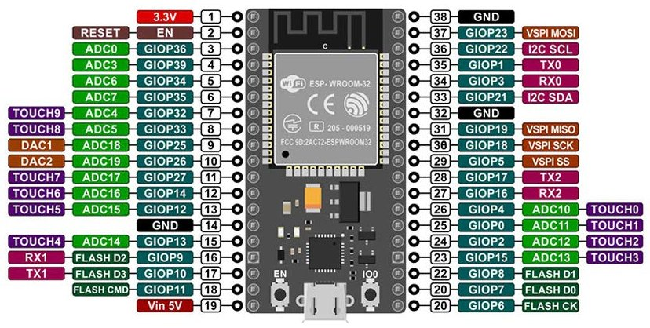

# Development Guidelines


## Prerequisites

Before starting this installation procedure, make sure you have the latest version of the Arduino IDE installed in your computer. You can install the latest Arduino IDE software from [arduino.cc/en/software](https://www.arduino.cc/en/software).


### Installing ESP32 Boards in Arduino IDE

To install the ESP32 board in your Arduino IDE, follow the instructions given below,

1. In your Arduino IDE, go to **File > Preferences**


2. Enter https://dl.espressif.com/dl/package_esp32_index.json into the **Additional Boards Manager URLs** field as shown in the figure below.


**Note:** If you already have the ESP8266 boards URL, you can separate the URLs with a comma as follows,

```
https://dl.espressif.com/dl/package_esp32_index.json, http://arduino.esp8266.com/stable/package_esp8266com_index.json
```

3. Open the Boards Manager. Go to **Tools > Board > Boards Manager**


4. Search for ESP32 and press install button for the **ESP32 by Espressif Systems**:


5. That’s it. It should be installed after a few seconds.


### Testing the Installation

After successfully completing the steps above, you'll be able to see ESP32 based boards such as Microduino-CoreESP32 in your Arduino IDE boards list, and you can choose your desired board to upload the code. Plug the ESP32 board to your computer. With your Arduino IDE open, follow the steps below,

1. Select your board in **Tools > Board** menu (in our case, Microduino-CoreESP32)

2. Select the port (if you don’t see the COM Port in your Arduino IDE, you need to install the [CP210x USB to UART Bridge VCP Drivers](https://www.silabs.com/products/development-tools/software/usb-to-uart-bridge-vcp-drivers)):

3. Open any ESP32 example for testing, for example, **File > Examples > WiFi (ESP32) > WiFiScan**

4. Press the Upload button in the Arduino IDE. Wait a few seconds while the code compiles and uploads to your board.

5. If everything went as expected, you should see a “Done uploading.” message.


6. Open the Arduino IDE Serial Monitor at a baud rate of 115200:


### Troubleshooting

If you try to upload a new sketch to your ESP32 and you get this error message **"A fatal error occurred: Failed to connect to ESP32: Timed out… Connecting…"**. It means that your ESP32 is not in flashing/uploading mode.

Having the right board name and COM port selected, follow the steps below,

1. Hold-down the **BOOT** button in your ESP32 board


2. Press the “Upload” button in the Arduino IDE to upload your sketch. After you see the  **“Connecting….”** message in your Arduino IDE, release the finger from the **BOOT** button


**Note:** You’ll also have to repeat that button sequence every time you want to upload a new sketch. But if you want to solve this issue once for all without the need to press the **BOOT** button, follow the solution provided by [[SOLVED] Failed to connect to ESP32: Timed out waiting for packet header | Random Nerd Tutorials](https://randomnerdtutorials.com/solved-failed-to-connect-to-esp32-timed-out-waiting-for-packet-header/).


## Board Layout

You can see the ESP32 board's basing diagram or pinout below,

